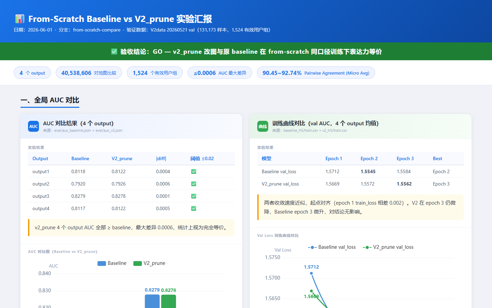
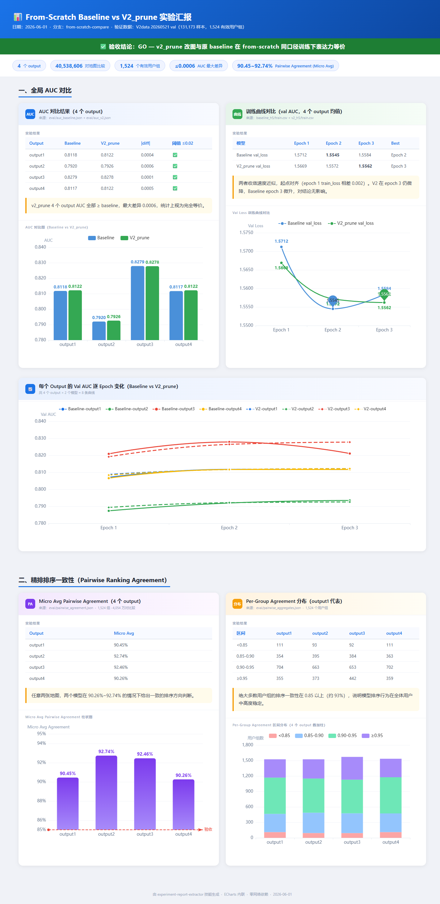

# experiment-report-extractor

一个 Claude Code Skill，用于从多个 Markdown 实验记录中自动提取关键信息，并生成一份带有交互图表的单文件 HTML 汇报。

---

## 📸 效果预览





---

## ✨ 功能特性

- 📂 **多文件扫描**：自动遍历目录，识别所有 `.md` 实验文档
- 🔍 **混合提取策略**：规则匹配优先，LLM 智能兜底，适配结构化与自由格式文档
- 📊 **自动绘图**：关联 CSV / JSON 等数据文件，自动选择折线图 / 柱状图 / 散点图
- 📦 **零依赖输出**：生成单个独立 HTML 文件，ECharts 完整内联，离线打开即用
- 🎨 **现代卡片布局**：浅灰底 + 白色卡片 + 蓝色强调色，字体与图表尺寸保证可读性

---

## 📋 提取字段

每篇 Markdown 提取三个字段：

| 字段 | 匹配规则（优先级从高到低）|
|------|--------------------------|
| **实验名称** | `#` 一级标题 → `## 实验名称/标题` → 文件名 |
| **实验结果** | `## 结果/实验结果/数据` → 模糊标题匹配 → 第一个表格 |
| **结论** | `## 结论/总结/讨论` → 模糊标题匹配 → 最后一段 |

任何字段无法提取时，自动触发 LLM 全文理解；仍无结果则显示「未提取到该信息」。

---

## 📁 数据文件关联规则

| 优先级 | 规则 |
|--------|------|
| 1 | 同名匹配：`exp1.md` 自动关联 `exp1.csv` / `exp1.json` 等 |
| 2 | 目录分组：子目录内的 `.md` 关联同目录下所有数据文件 |
| 3 | 手动指定：用户明确说明关联关系时优先采用 |

**支持格式**：`.csv` / `.tsv` / `.json` / `.jsonl` / `.xlsx`，格式模糊时 LLM 自动解析。

**图表类型自动选择**：

| 数据形态 | 图表类型 |
|----------|----------|
| 两列（索引 + 数值）| 折线图 |
| 一列类别 + 一列数值 | 柱状图 |
| 三列以上数值 | 多系列折线图 |
| 两列数值对 | 散点图 |
| Markdown 中注释 `<!-- chart: bar -->` | 按指定类型 |

---

## 🖥️ 输出效果

```
report.html
├── 页头：项目标题 + 统计条（实验数 / 图表数）
├── 实验卡片 #01
│   ├── 实验名称（来源文件名）
│   ├── 实验结果（文本 + 表格）
│   ├── 结论（黄色左边框高亮框）
│   └── ECharts 图表（如有数据文件）
├── 实验卡片 #02
│   └── ...
└── Footer
```

- 图表高度 ≥ 360px，所有字体 ≥ 14px
- X 轴标签自动旋转防重叠，dense 图表自动隐藏数据标签
- ECharts 完整源码内联，无 CDN 依赖，离线可用

---

## 🚀 使用方式

在 Claude Code 中直接用自然语言触发：

```
帮我处理 /path/to/experiments/ 目录，生成实验汇报
```

Claude 会自动：
1. 扫描目录中所有 `.md` 和数据文件
2. 提取每篇文档的实验名称、实验结果、结论
3. 解析关联数据文件并选择图表类型
4. 将 ECharts 内联嵌入，生成 `report.html`
5. 输出到输入目录（或用户指定位置）

---

## 📦 安装

将 `SKILL.md` 放入 Claude Code 的 skills 目录即可：

```bash
# Claude Code
~/.claude/skills/experiment-report-extractor/SKILL.md
```

---

## 📐 设计约束（Hard Rules）

以下规则在技能文档中强制执行，Claude 不会因用户要求而违反：

| 规则 | 原因 |
|------|------|
| 图表库只用 ECharts，禁止 Chart.js / Plotly | 一致性与离线支持 |
| ECharts 必须内联，禁止 CDN 引用 | 保证文件零外部依赖 |
| 只提取三个字段，不自行增减 | 保持输出结构可预期 |
| 不捏造或推算数据文件中不存在的数值 | 实验报告的数据诚实性 |
| 图表字体 ≥ 14px，高度 ≥ 360px | 保证可读性 |

---

## 🗂️ 文件结构

```
experiment-report-extractor/
├── SKILL.md          # 技能主文件（Claude Code 读取此文件）
├── README.md         # 本文档
└── demo/
    ├── exp1.md       # 示例实验文档（结构化格式）
    ├── exp1.csv      # 示例数据文件
    ├── exp2.md       # 示例实验文档（自由格式）
    ├── exp2.csv      # 示例数据文件
    └── report.html   # 示例输出（由技能生成）
```
